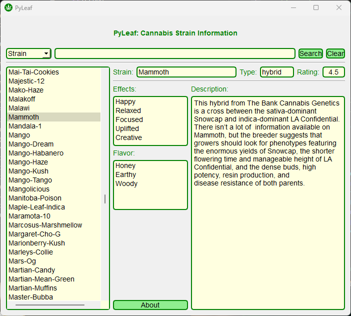

# PyLeaf
This is a Python program that uses PySide6 to create a GUI app that displays information about cannabis strains. Written in Python 3.11.5, and PySide6 5.xx

##
## Dataset: 

The dataset used in this app is from Kaggle:
https://www.kaggle.com/datasets/kingburrito666/cannabis-strains/
##

#### Dependencies:
`pip install pyside6`

## Screen shots

## License: MIT

Do whatever you want with it.

### Notes:
The data comes preformatted in a SQLite3 database and a CSV file.
